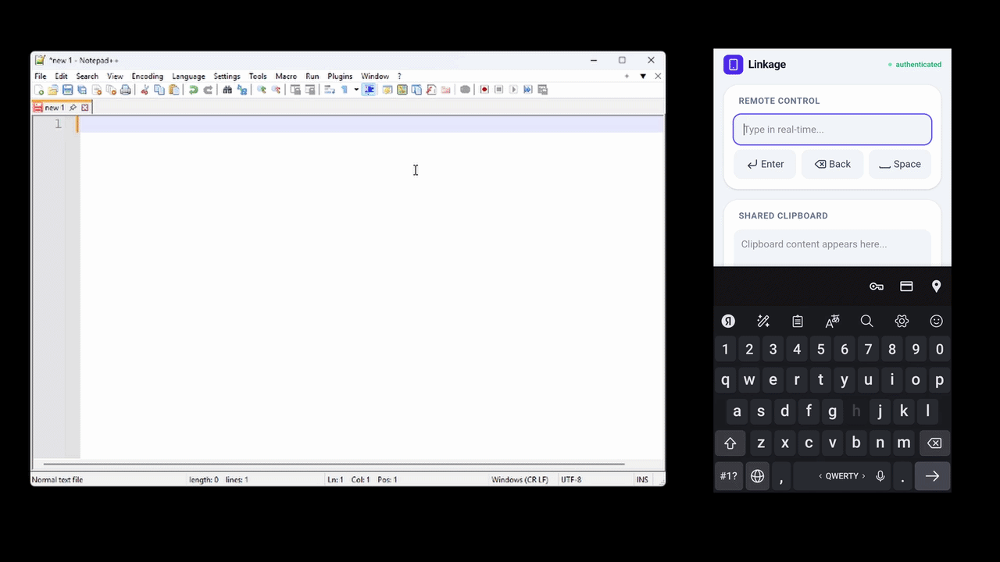
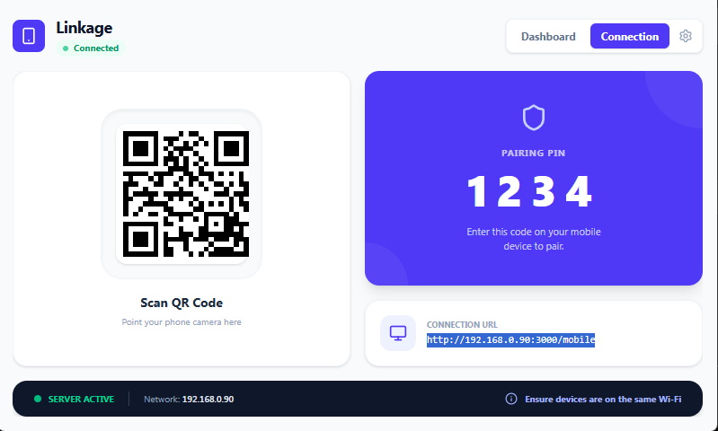

<p align="center">
  
</p>

<h1 align="center">Linkage</h1>

<p align="center">
  <strong>The seamless bridge between your mobile device and Windows PC.</strong><br>
  Real-time typing, ultra-fast file transfers, and a unified clipboard—all in one lightweight, private tool.
</p>

<p align="center">
<a href="https://github.com/ManHuman504/Linkage/releases">

</a>
<a href="https://github.com/ManHuman504/Linkage/blob/main/LICENSE">

</a>
</p>

---

## 📖 Overview

**Linkage** was designed with a simple goal: to make your mobile device a natural extension of your PC. Whether you need to type long messages using your phone’s T9 keyboard, send large files instantly, or share text across devices, Linkage handles it with zero fuss.

Think of it as the **Apple Ecosystem experience for Windows**, but even more flexible—because the mobile side is web-based, it works with **any device** (iPhone, Android, Tablets) without installing a single app.

### 🎥 Live Demos
<table>
  <tr>
    <td width="50%">
      <p align="center"><strong>Instant File Transfer</strong></p>
      
    </td>
    <td width="50%">
      <p align="center"><strong>Real-Time Typing (T9/Emoji)</strong></p>
      
    </td>
  </tr>
</table>

*Top-tier speed: Files arrive instantly, and text appears as you type—with full support for emojis, special characters, and any language.*

---

## ✨ Key Features

- ⌨️ **Real-Time Remote Typing**: Use your phone to type directly into any text field on your PC. Full support for mobile T9, autocorrect, and emojis.
- 📁 **High-Speed File Transfer**: Send photos, videos, and large documents directly over your local network. No cloud, no limits, no compression.
- 📋 **Shared Clipboard**: Copy on your phone, paste on your Windows PC instantly.
- 🚀 **Performance-First**: Built with **Rust** and **Tauri**, consuming only **~45MB of RAM**.
- 🔐 **Ultimate Privacy**: Your data stays in your room. Transfers happen exclusively over your local IP (Wi-Fi), making it 100% anonymous and secure.
- 🛠 **Zero-Config Deployment**: Simple installer, intuitive UI. Anyone can get it running in seconds.

---

## 📸 Screenshots
<p align="center">
  
  <br><em>The clean, intuitive pairing interface.</em>
</p>

---

## 🛠 Tech Stack

- **Backend**: Rust (Axum + Socketioxide)
- **Desktop**: Tauri v2 (Rust + React + TypeScript)
- **Mobile**: React + TailwindCSS + Socket.io-client
- **Security**: Local P2P via Wi-Fi, Digital Signatures for updates.

---

## 📖 How to Use

1. Launch the app on your PC.
2. Go to the **Connection** tab.
3. Scan the QR code with your phone camera or enter the URL in your mobile browser.
4. Enter the 4-digit PIN displayed on your PC screen.
5. **Done!** Your devices are now linked.

> 💡 **Pro Tips:**
> - **Remembered Devices**: Once paired, your device is remembered automatically. You won't need to enter the PIN again unless you reset it. (You can manage or clear trusted devices anytime in the **Settings** tab).
> - **Custom PIN**: You can change your pairing PIN in the settings for added security or convenience.
> - **Quick Access**: For the best experience, use the **"Add to Home Screen"** feature in your mobile browser. This creates an icon on your phone that launches Linkage instantly like a native app.

---

## 🚀 Getting Started

### Download the App
1. Go to the **[Releases](https://github.com/ManHuman504/Linkage/releases)** page.
2. Download the `.msi` or `.exe` installer.
3. Launch Linkage and start syncing.

### For Developers
```bash
# Clone the repo
git clone https://github.com/ManHuman504/Linkage.git

# Install & Run
cd linkage-desktop
npm install
npx tauri dev
```

---

## ⚠️ Alpha Version Notice
Please note that Linkage is currently in **Alpha (v0.1.0)**. While we strive for absolute stability, you may encounter minor bugs. We are working hard to make every connection rock-solid.

---

## 🗺 Roadmap (Plans for v2.0)

- [ ] **Global P2P**: Connect devices over the internet using secure codes/passwords without central servers.
- [ ] **Remote Touchpad**: Turn your phone screen into a wireless mouse/trackpad for your PC.
- [ ] **Custom Macros**: Create custom buttons on your phone to trigger PC commands or complex shortcuts.
- [ ] **Enhanced Encryption**: Implementing E2EE (End-to-End Encryption) for all data streams.
- [ ] **Multi-Device Support**: Connect several phones or tablets to a single PC simultaneously.
- [ ] **Remote QR Scanner**: Scan a QR code on your phone and have the result open instantly on your computer.

---

## 📄 License
Distributed under the MIT License. See `LICENSE` for more information.

---
<p align="center">Created with ❤️ for the open-source community.</p>
